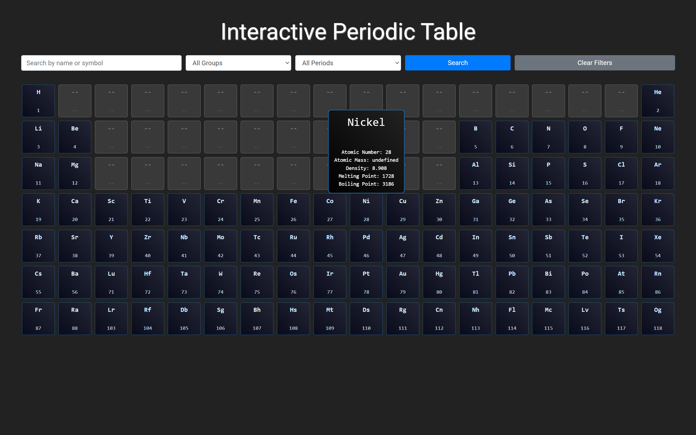

## Periodic Table Visualization

#### Steps
1. Setup db (I have used mongoDB)
2. Scrape data from Wikipedia and save it to db
3. run server `poetry run uvicorn main:app --reload`

#### preview

## Features to do
#### Visual Enhancements
Color Coding
Atomic Structure View

#### Data Insights & Analysis
Graphs & Charts:
- Show trends like electronegativity vs. atomic number.
- Density vs. atomic mass scatter plot.

Element Comparisons: Let users compare properties of multiple elements side by side.
Historical Timeline: Show when elements were discovered and who discovered them.

#### Educational Features
Discovery History: Include fun facts about how elements were named or discovered.
Isotopes Information: Display common isotopes and their half-lives.

#### Advanced Features
Reactivity Simulation: Show possible chemical reactions between elements.